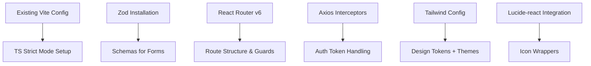

# Phase 2: Technology Stack Selection - Detailed Sub-tasks

**Parent Plan**: PLAN_frontend_architecture.md  
**Date Generated**: 2025-09-12

---

## 2.1 Bundle Management & Vite Configuration

| # | Sub-task Description | Implementation Details | Complexity | Dependencies |
|---|----------------------|------------------------|------------|--------------|
| **2.1.1** | Keep existing Vite configuration base | - Review current `vite.config.js`<br/>- Ensure React + HMR plugins are active<br/>- Verify no breaking changes from updates | Low | None |
| **2.1.2** | Add Vite optimization flags | - Configure `build:lib` optimization for library builds<br/>- Set `build:module` for ES module outputs<br/>- Enable `assetFilterPatterns` for asset optimization | Medium | None |
| **2.1.3** | Configure output paths & asset plugins | - Define `output: "dist"` directory<br/>- Add React-refresh plugin if hot-reload issues occur<br/>- Set up asset compression filters (images, fonts) | Low | None |

---

## 2.2 TypeScript Setup with Strict Mode

| # | Sub-task Description | Implementation Details | Complexity | Dependencies |
|---|----------------------|------------------------|------------|--------------|
| **2.2.1** | Create `tsconfig.json` with strict config | - Set `"strict": true`<br/>- Enable `"noImplicitAny": true`<br/>- Configure `"skipLibCheck": true`<br/>- Add JSDoc support for legacy code<br/>- Set `"moduleResolution": "bundler"` or `"node"` | Low | None |
| **2.2.2** | Configure path aliases and baseUrl | - Add `"paths": {"@/*": ["src/app/*"]}`<br/>- Enable `"baseUrl": "."`<br/>- Setup TypeScript module resolution for ESM | Medium | Vite configured |
| **2.2.3** | Create type declaration files | - Generate `vite-env.d.ts`<br/>- Add node module declarations if needed<br/>- Define global CSS types (if not covered) | Low | None |
| **2.2.4** | Setup `tsconfig.app.json` & `tsconfig.node.json` | - Split app vs worker configs in monorepo setup<br/>- Configure specific lib types for build scripts<br/>- Keep separate declaration files per workspace section | Medium | Monorepo structure exists |

---

## 2.3 State Management: Zustand vs Redux Toolkit Comparison

### Decision Matrix

| Criteria | Zustand | Redux Toolkit | Winner for this Project |
|----------|---------|---------------|--------------------------|
| **Bundle Size** | ~1KB (gzipped) | ~16KB (minified) | ✅ Zustand |
| **Learning Curve** | Simple hooks API | RTK Query learning curve | ⚖️ Equal |
| **DevTools** | Basic support | Excellent DevTools ecosystem | 🏆 Redux Toolkit |
| **Performance** | Reactive, minimal re-renders | Strict immutability pattern | ⚖️ Comparable |
| **Middleware Support** | Limited, custom hooks needed | Rich middleware ecosystem (thunk, saga) | 🏆 Redux Toolkit |
| **Async Handling** | Built-in `create()` hook | RTK Query + thunk | 🤝 Equal |

### Decision: Zustand Preferred Rationale

- Lightweight with negligible bundle impact
- Hooks-based API fits React 18+ patterns well
- Sufficient for app scale (no Redux-level complexity needed)
- Easy migration path if needs grow later

### Recommended Stack Choice

```json
// package.json dependency decision
{
  "zustand": "^4.5.0" 
}
```

---

## 2.4 React Router v6 Installation & Route Structure

| # | Sub-task Description | Implementation Details | Complexity | Dependencies |
|---|----------------------|------------------------|------------|--------------|
| **2.4.1** | Install React Router v6.x | - Run `npm install react-router-dom@^6`<br/>- Verify package-lock resolution<br/>- Check peer dependency satisfaction | Low | None |
| **2.4.2** | Configure browser routing setup | - Setup `<Routes>` and `<Route>` exports<br/>- Add error boundary for route failures<br/>- Create `layout/index.tsx` template route | Medium | Component library ready |
| **2.4.3** | Plan route hierarchy structure | Design route tree: `/` (root) → `/login`, `/register` → `/dashboard` → private sub-routes → `/settings` → etc. | Low | Auth system complete |
| **2.4.4** | Create route guard components | - Implement `PrivateRoute` wrapper component<br/>- Setup redirect guards for auth states<br/>- Add loading skeletons per route | Medium | All routes planned |
| **2.4.5** | Configure lazy-loaded route chunks | - Use React.lazy() + Suspense<br/>- Define route-specific chunk imports<br/>- Optimize initial bundle size | Medium | Build optimization done |

### Example Route Structure Plan:

```typescript
// routes.tsx structure reference
<Route path="/" element={<Layout />}>
  <Route index element={<Dashboard />} />
  
  // Auth routes (public)
  <Route path="login" element={<LoginPage />} />
  <Route path="register" element={<RegisterPage />} />
  
  // Protected routes
  <Route path="dashboard/*" element={PrivateRoute(DashboardGroup)} />
  <Route path="settings/*" element={PrivateRoute(SettingsPage)} />
</Route>
```

---

## 2.5 Axios Interceptors for Auth/Token Handling

| # | Sub-task Description | Implementation Details | Complexity | Dependencies |
|---|----------------------|------------------------|------------|--------------|
| **2.5.1** | Install axios if not present | - Run `npm install axios@^1`<br/>- Verify no version conflicts<br/>- Check browser polyfill needs (if any) | Low | None |
| **2.5.2** | Create auth interceptor for tokens | - Intercept `GET /token` on request<br/>- Refresh JWT if expired (401/403)<br/>- Clear storage on 401 unauthorized errors | High | Backend API documented |
| **2.5.3** | Configure response error interceptors | - Handle `axios:isAxiosError` flags<br/>- Map HTTP errors to user-friendly messages<br/>- Trigger toast notification for non-critical failures | Medium | UI component library ready |
| **2.5.4** | Setup request headers middleware | - Auto-append `Authorization: Bearer ${token}`<br/>- Add `Content-Type: application/json` per route<br/>- Inject API version if needed (e.g., `/api/v1/`) | Low | None |
| **2.5.5** | Create reusable axios instance | - Define global default timeout settings<br/>- Configure base URLs for staging/prod environments<br/>- Export singleton `axiosInstance` from utils folder | Low | None |

### Example Implementation:

```typescript
// src/lib/axios.ts structure reference
const apiInstance = axios.create({
  baseURL: process.env.VITE_API_URL,
  timeout: 5000,
  headers: {'X-Custom-Header': 'Enabled'},
}) as unknown as AxiosInstance;

apiInstance.interceptors.request.use(config => { /*...*/ config };

apiInstance.interceptors.response.use(response => response, error => { /*...*/ error};
```

---

## 2.6 Zod Validation Schemas for Forms

| # | Sub-task Description | Implementation Details | Complexity | Dependencies |
|---|----------------------|------------------------|------------|--------------|
| **2.6.1** | Install zod if not present | - Run `npm install zod@^3`<br/>- Add zod to dependencies list<br/>- Verify peer dependency conflicts (typescript) | Low | None |
| **2.6.2** | Define user registration schema | - Email regex validation<br/>- Password: minLength, match rules via refinements<br/>- Confirm password field matching<br/>- Generate inferred types for React component props | Medium | Backend API documented |
| **2.6.3** | Create login form schemas | - Email + password pairs<br/>- Remember me boolean checkbox type<br/>- Error message parsing from API response | Low | Auth endpoints available |
| **2.6.4** | Setup reusable compose() validators | - Combine schema() with object().passthrough()<br/>- Enable optional fields with .optional()<br/>- Create union schemas for enum selections | Medium | Schema patterns defined |
| **2.6.5** | Generate OpenAPI Zod types (if applicable) | - Use `swagger-schema-official` to generate types<br/>- Map Swagger/OpenAPI JSON → Zod schema<br/>- Automate schema regeneration on API changes via script | High | Backend has OpenAPI docs |

### Example Schema Implementation:

```typescript
// src/lib/zod.ts structure reference
export const LoginFormSchema = z.object({
  email: z.string().email('Invalid email').min(1, 'Required'),
  password: z.string().min(8, 'Min length 8').max(100),
  remember: z.boolean(),
});

export type LoginFormData = z.infer<typeof LoginFormSchema>;
```

---

## 2.7 Tailwind Design System Initialization

| # | Sub-task Description | Implementation Details | Complexity | Dependencies |
|---|----------------------|------------------------|------------|--------------|
| **2.7.1** | Keep existing Tailwind installation | - Review current `tailwind.config.js`<br/>- Verify PostCSS compatibility<br/>- Check browserlist config is in sync | None | None |
| **2.7.2** | Initialize design tokens | - Define primary/secondary/accent color palettes<br/>- Create semantic colors (success, warning, error)<br/>- Add dark theme variables to `theme.extend.colors` object | Medium | Visual system decisions made |
| **2.7.3** | Configure font families & sizes | - Set heading hierarchy H1-H6 in config<br/>- Define text weights: light/normal/bold/black<br/>- Setup responsive font scaling for mobile breakpoints | Low | Brand guidelines available |
| **2.7.4** | Add animations/transitions | - Import AOS animation library if using scroll effects<br/>- Setup transition timings (duration, timing-function)<br/>- Define hover state transitions for interactive elements | Medium | Component hover states needed |
| **2.7.5** | Enable dark mode support | - Configure `darkMode: "class"` or `"media"<br/>- Add dark class utilities to component defaults<br/>- Setup theme toggle logic in main app layout | Medium | Layout components exist |

### Example Tailwind Configuration:

```typescript
// tailwind.config.js structure reference
module.exports = {
  content: ["./src/**/*.{js,jsx,ts,tsx}"],
  darkMode: 'class',
  theme: {
    extend: {
      colors: {
        primary: {...},
        secondary: {...},
        success: {...},
        warning: {...},
      },
    },
  },
  plugins: [require('@tailwindcss/forms')],
}
```

---

## 2.8 Lucide-react Icon Library Integration

| # | Sub-task Description | Implementation Details | Complexity | Dependencies |
|---|----------------------|------------------------|------------|--------------|
| **2.8.1** | Install lucide-react package | - Run `npm install lucide-react@latest`<br/>- Verify no size inflation issues<br/>- Check ESM/CJS module compatibility | Low | None |
| **2.8.2** | Create icon component wrappers | - Build accessible `<Icon />` wrapper components<br/>- Add hover/scale animations to icons<br/>- Configure SVG color inheritance from parents | Medium | UI components existing |
| **2.8.3** | Set up icon size variants utilities | - Define standard sizes (sm, md, lg, xl)<br/>- Create responsive icon sizing based on breakpoint<br/>- Document size usage patterns for team consistency | Low | Icon library installed |
| **2.8.4** | Organize icon imports | - Group related icons in `src/lib/icons.ts` folder<br/>- Export commonly used icons as tree-shakeable chunks<br/>- Create icon mapping for legacy Feather icons if migration needed | Medium | Component patterns defined |
| **2.8.5** | Test icon rendering edge cases | - Verify fallback icons on error states<br/>- Test screen reader accessibility (aria labels)<br/>- Ensure proper SVG semantics for semantic structure | Low | Icons deployed |

### Icon Usage Reference:

```tsx
// src/ui/icon.tsx reference example
interface IconProps {
  name: string;
  size?: 'sm' | 'md' | 'lg' | 'xl';
}

const Icon = ({ name, size = "md" }: IconProps) => {
  const IconComponent = Icons[name as keyof typeof Icons] || null;
  
  return (
    <IconComponent 
      width={ICON_SIZES[size]}
      height={ICON_SIZES[size]}
      className="text-primary"
    />
  );
}
```

---

## Priority Grouping

### Phase 2 Priority Levels:

**Priority #1 - Foundation**: Bundle/Vite, TypeScript strict mode installation  
**Priority #2 - Core Framework**: React Router skeleton, Axios instance setup  
**Priority #3 - Design System**: Tailwind + Lucide-react initialization  
**Priority #4 - Utilities**: Zod schemas for auth forms, Zustand store creation  

---

## Dependencies Summary (Phase 2)



---

## Success Criteria (Phase 2)

✅ **All dependencies installed** and lockfile updated  
✅ **TypeScript compiles without errors** in strict mode  
✅ **React Router skeleton routes render** correctly  
✅ **Axios interceptors handle auth flow** without manual token management  
✅ **Zod schemas validate forms** with appropriate error messages  
✅ **Tailwind design system initialized** with color tokens and themes loaded  
✅ **Lucide-react icons integrate seamlessly** into UI components  

---

## Next Phase Transition (Phase 3)

Once Phase 2 is complete:
- Enable building/running React app locally without errors  
- Verify Vite HMR works at `localhost:5173` with optimized config  
- Test component imports with strict TS checking enabled  
- Proceed to **Phase 3: UI/UX Design System Implementation** (Layout components, Reusable primitives, Visual design system)
