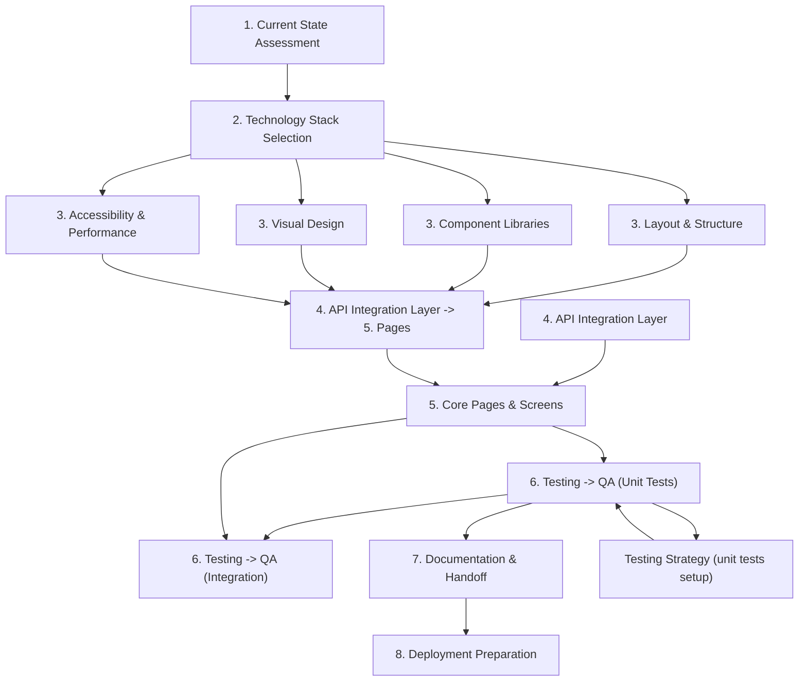

# Task Plan: Generate Frontend Architecture for Current Project

**Generated**: 2025-09-12

**Updated**: 2025-09-12 (Phase 1 complete)

## Overview

This plan outlines the development of the frontend architecture for the `frontend` project, leveraging existing Vite + React setup and establishing a robust TypeScript-based component system with Tailwind CSS styling.

---

## 1. Current State Assessment

| #   | Task                     | Sub-tasks                                                                                                                          | Complexity       | Dependencies      |
| --- | ------------------------ | ---------------------------------------------------------------------------------------------------------------------------------- | ---------------- | ----------------- |
| **1.0** | ✅ Initial assessment complete | 📄 Report: `results/current_state_assessment.txt` 🔍 Findings:   • Project: Skeleton (~0-5% progress)   • Configured: Vite + TypeScript skeleton   • TODO: Initialize src/, routing, Tailwind   • Ready for Priority 2 (React Router) | Medium     | None              |
| 1   | Define layout components | - Create `Layout` component wrapper - Design responsive skeleton structure - Add mobile-first breakpoints (sm, md, lg, xl) | Low        | Initial assessment done          |
| 2   | Create header/navigation | - Responsive header with logo - Navigation bar implementation - Breadcrumb support for deep routes                         | Medium     | Layout components               |

---

## 2. Technology Stack Selection

### Recommended Configuration

| Category          | Selection                       | Rationale                                              | Complexity                |
| ----------------- | ------------------------------- | ------------------------------------------------------ | ------------------------- |
| **Bundle**        | Vite (keep existing)            | Fast HMR, modern tooling, low overhead                 | None (already configured) |
| **Language Type** | TypeScript (strict mode)        | Full type safety, excellent DX                         | Low                       |
| **UI Framework**  | React + Tailwind                | Already in rules docs, great ecosystem                 | None                      |
| **State**         | Zustand or Redux Toolkit        | Lightweight options (Zustand preferred for this scale) | Medium                    |
| **Routes**        | React Router v6                 | Industry standard, easy to configure                   | Low                       |
| **HTTP Client**   | Axios (keep)                    | Already in rules; consistent with backend calls        | None                      |
| **Validation**    | Zod + Formik or React Hook Form | Type-safe form validation                              | Medium                    |
| **Icons**         | Lucide-react (React icons)      | Clean SVG icons, lightweight                           | Low                       |

---

## 3. UI/UX Design System

### Phase 3.1: Layout & Structure

| #   | Task                     | Sub-tasks                                                                                                                          | Complexity | Dependencies      |
| --- | ------------------------ | ---------------------------------------------------------------------------------------------------------------------------------- | ---------- | ----------------- |
| 1   | Define layout components | - Create `Layout` component wrapper - Design responsive skeleton structure - Add mobile-first breakpoints (sm, md, lg, xl) | Medium     | None              |
| 2   | Create header/navigation | - Responsive header with logo - Navigation bar implementation - Breadcrumb support for deep routes                         | Medium     | Layout components |

### Phase 3.2: Component Libraries

| #   | Task                        | Sub-tasks                                                                                                                    | Complexity | Dependencies                |
| --- | --------------------------- | ---------------------------------------------------------------------------------------------------------------------------- | ---------- | --------------------------- |
| 3   | Develop reusable primitives | - Buttons (variants, sizes) - Modals/Dialogs - Cards/Data display components - Input fields with labels          | Medium     | Layout components           |
| 4   | Build form elements         | - Text inputs with validation UI - Select/dropdown components - Checkboxes & radio groups - File upload dropzone | Medium     | Validation library selected |

### Phase 3.3: Visual Design

| #   | Task                 | Sub-tasks                                                                                                                                     | Complexity | Dependencies              |
| --- | -------------------- | --------------------------------------------------------------------------------------------------------------------------------------------- | ---------- | ------------------------- |
| 5   | Define color palette | - Primary/Secondary/accent colors - Semantic colors (success, warning, error) for API states - Dark/light theme variables in Tailwind | Low        | Component library ready   |
| 6   | Typography system    | - Set heading hierarchy (H1-H6) - Text weights and sizes - Base fonts based on brand guidelines                                       | Low        | Typography decisions made |
| 7   | Implement theming    | - Configure tailwind.config.ts themes - Dark mode toggle implementation<br/- Animation/transitions for theme switch                       | Medium     | Color palette defined     |

### Phase 3.4: Accessibility & Performance

| #   | Task                     | Sub-tasks                                                                                                                                                | Complexity | Dependencies                     |
| --- | ------------------------ | -------------------------------------------------------------------------------------------------------------------------------------------------------- | ---------- | -------------------------------- |
| 8   | ARIA compliance audit    | - Add semantic HTML everywhere - Keyboard navigation patterns<br/- Focus trapping for modals - Screen reader announcements                       | Medium     | All interactive components exist |
| 9   | Performance optimization | - Implement lazy loading for routes - Code splitting strategy setup - Image optimization (WebP/AVIF) - Service worker/PWA support (optional) | Medium     | Routing complete                 |

---

## 4. API Integration Layer

### Phase 4.1: HTTP Communication Setup

| #   | Task                      | Sub-tasks                                                                                                                         | Complexity | Dependencies                      |
| --- | ------------------------- | --------------------------------------------------------------------------------------------------------------------------------- | ---------- | --------------------------------- |
| 10  | Create API service layer  | - Setup Axios interceptors - Configure request timeout/error handling - Auth token refresh handling                       | Medium     | React Router routes defined       |
| 11  | Build type-safe endpoints | - Define TypeScript types for all APIs - Generate Zod schemas from OpenAPI if available - Handle API responses gracefully | High       | Backend APIs documented/available |

### Phase 4.2: Real-time Features

| #   | Task                          | Sub-tasks                                                                                           | Complexity | Dependencies                  |
| --- | ----------------------------- | --------------------------------------------------------------------------------------------------- | ---------- | ----------------------------- |
| 12  | WebSocket integration         | - Create connection manager - Handle reconnection logic<br/- Streaming data display (chat/logs) | Medium     | API service layer complete    |
| 13  | Live updates polling fallback | - Implement polling with exponential backoff for non-browser clients                                | Medium     | WebSocket implementation done |

---

## 5. Core Pages & Screens

### Phase 5.1: Authentication Flow

| #   | Task                       | Sub-tasks                                                                                         | Complexity | Dependencies                |
| --- | -------------------------- | ------------------------------------------------------------------------------------------------- | ---------- | --------------------------- |
| 14  | Login/Register pages       | - Email/password forms - OAuth login (if available) - Remember me & forgot password flows | Medium     | API endpoints available     |
| 15  | Auth state synchronization | - Store JWT/access tokens securely<br/- Protected route guards - Logout redirect handling     | Medium     | Auth service layer complete |

### Phase 5.2: Main Application Screens

| #   | Task                  | Sub-tasks                                                                                      | Complexity | Dependencies        |
| --- | --------------------- | ---------------------------------------------------------------------------------------------- | ---------- | ------------------- |
| 16  | Dashboard/Home screen | - Welcome messaging - Quick actions panel - Recent activity feed placeholder           | Medium     | Auth system working |
| 17  | Settings screen       | - User profile editing - Notification preferences - API key management (if applicable) | Low        | Layout complete     |

---

## 6. Testing & Quality Assurance

### Phase 6.1: Test Strategy

| #   | Task                 | Sub-tasks                                                                                                                              | Complexity | Dependencies               |
| --- | -------------------- | -------------------------------------------------------------------------------------------------------------------------------------- | ---------- | -------------------------- |
| 18  | Unit tests structure | - Setup Jest (or alternative) + React Testing Library - Component wrapper utilities<br/- Mock API responses for isolating UI tests | Medium     | All components implemented |
| 19  | Integration tests    | - Test page navigation flows - Form submission end-to-end - Error state handling                                               | Medium     | Unit tests passing         |

### Phase 6.2: Performance Testing

| #   | Task                 | Sub-tasks                                                                                                         | Complexity | Dependencies           |
| --- | -------------------- | ----------------------------------------------------------------------------------------------------------------- | ---------- | ---------------------- |
| 20  | Bundle size analysis | - Run bundle audit for unused dependencies - Tree-shaking verification<br/- Image payload optimization review | Low        | All assets implemented |

---

## 7. Documentation & Handoff

### Phase 7.1: Code Documentation

| #   | Task                    | Sub-tasks                                                                                                              | Complexity | Dependencies        |
| --- | ----------------------- | ---------------------------------------------------------------------------------------------------------------------- | ---------- | ------------------- |
| 21  | Component documentation | - Document props/children for each component - Usage examples in code comments - API reference page generation | Medium     | Components complete |
| 22  | Architecture docs       | - Create README for frontend folder - API integration guide - Deployment/instruction procedures                | Low        | Tests passing       |

### Phase 7.2: Development Workflow

| #   | Task                    | Sub-tasks                                                           | Complexity                              | Dependencies        |
| --- | ----------------------- | ------------------------------------------------------------------- | --------------------------------------- | ------------------- |
| 23  | ESLint + Prettier setup | - Configure rules for code style - Add git hooks if applicable< | - Linter auto-fix on save configuration | Project initialized |

---

## 8. Deployment Preparation (Optional Phase 8)

### Phase 8: Production Readiness

| #   | Task                  | Sub-tasks                                                                                                             | Complexity | Dependencies            |
| --- | --------------------- | --------------------------------------------------------------------------------------------------------------------- | ---------- | ----------------------- |
| 24  | Build optimization    | - Minimize bundle size<br/- Enable gzip/brotli compression - CDN asset linking for dependencies                   | Medium     | Final build successful  |
| 25  | Environment variables | - Create .env templates for prod staging - Document required env vars - CI/CD pipeline integration (optional) | Low        | Build configs finalized |

---

## Dependencies Summary

---

## Resources Needed

| Resource                | Description                              | Where to Find                    |
| ----------------------- | ---------------------------------------- | -------------------------------- |
| **API Documentation**   | Endpoints, types, auth method            | Backend docs/API server code     |
| **Design Assets**       | Brand guidelines, assets (if applicable) | Project style guides             |
| **Development Machine** | Node 16+, modern browser dev tools       | Standard development environment |

---

## Success Criteria

✅ **Phase 1 Complete**: Initial assessment finished, report saved to `results/current_state_assessment.txt`  
✅ **Phase 2 Complete**: TypeScript compiles without errors (strict mode)  
✅ **Phase 3 Complete**: All pages load, forms work, auth flow tested  
✅ **Phase 6 Complete**: Lighthouse score >90 on performance/accessibility  
✅ **Phase 7 Complete**: Component docs generated and reviewed

---

## Implementation Order Recommendation

**Priority 1**: Setup TypeScript + React Router skeleton (Tasks 2.1-2.3)  
**Priority 2**: Build core layout components (Tasks 3.1-3.2)  
**Priority 3**: Implement authentication flow (Tasks 5.1.x in parallel with Priority 2)  
**Priority 4**: Core page screens and features (Task 5.2.x)  
**Priority 5**: Add testing and documentation (Parallel during feature dev)

---
